# Task Master

### Version 1.0

- Built home page
- Add Task button that links to Add Task page
- All Tasks button that links to All Tasks page

### Version 2.0

- Home page updated with Settings button and 3 taskLocal buttons
- Settings page added with username saved to the home screen
- Task buttons 1, 2, 3 that link and update title depending on what is selected.

### Version 3.0

- Home page updated with RecyclerView that scrolls and you click on the title
- TaskAdapter class that displays data from a list of Tasks
- Task Model added. Task has title, body and a sta

### Version 4.0

- Modify Add Task form to save the data entered in as a Task in your local database.
- Home page updated RecyclerView to display all Task entities in database
- Detail Page has description and status of a tapped taskLocal. Also displayed on the detail page in addition to the title.

### Version 5.0

- Added Expresso tests.
- verified all features are working
- no new features to take pictures of

### Version 6.0

- Using `amplify add api` updated all Task data to instead use AWS Amplify
- Modify Add Task to save the data entered in as a task to DynamoDB
- Refactor homepage RecyclerView to display all Task entities in DynamoDB

### Version 7.0

- create a second entity for a team 
- create 3 teams
- Modify Add Task to include radio buttons for which team that task belongs to
- Settings page updated to allow username and choosing their team.

### Version 8.0
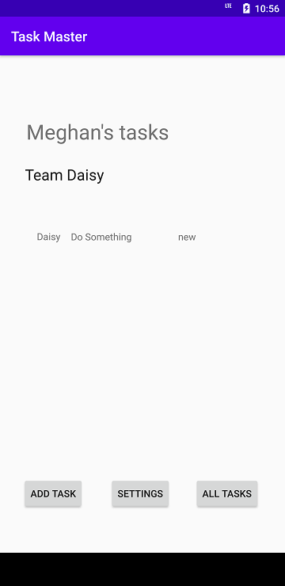

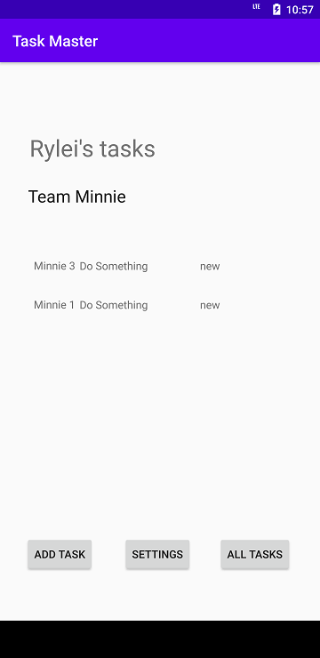

- Home page only shows tasks for the team the user selects on the settings page.
- Added a text view to display the team the user is on

### Version 9.0
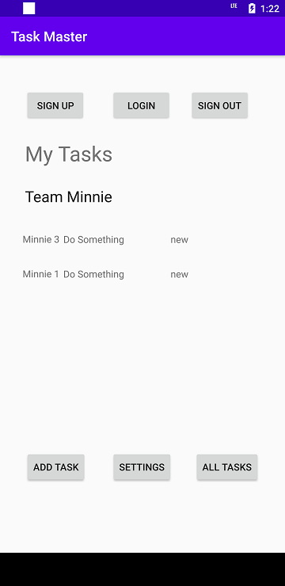

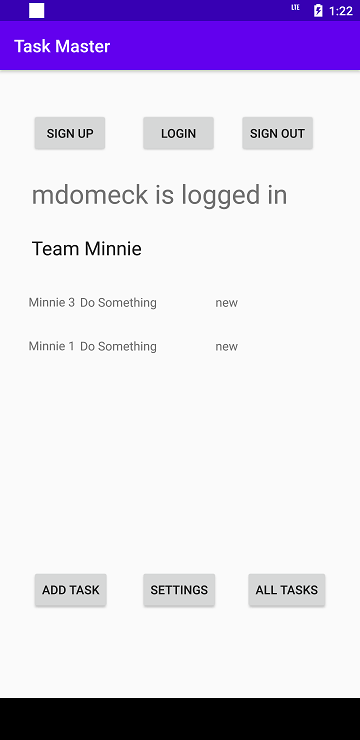

- Home page added Sign up, Login and Sign out buttons
- Added Cognito to Amplify setup. Added user login and sign up. Displays logged in username on the homepage.
- Logout button to sign out of the application

## Version 10.0
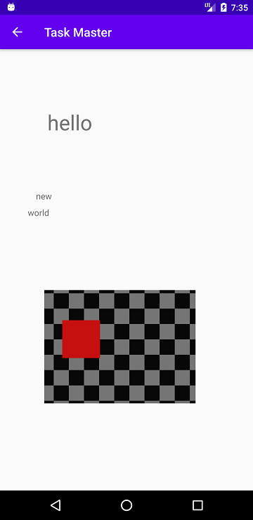

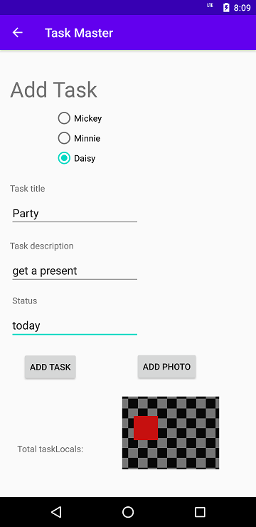

- On Add Task activity allow user to select a file to attach to that task.
- On Task detail activity if there is an image display within that activity

### Version 11.0
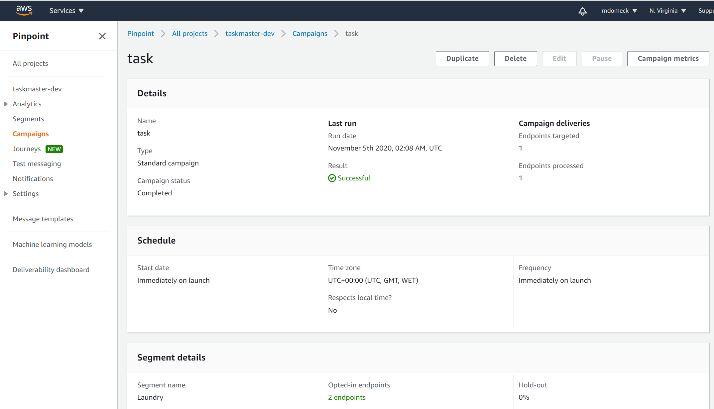

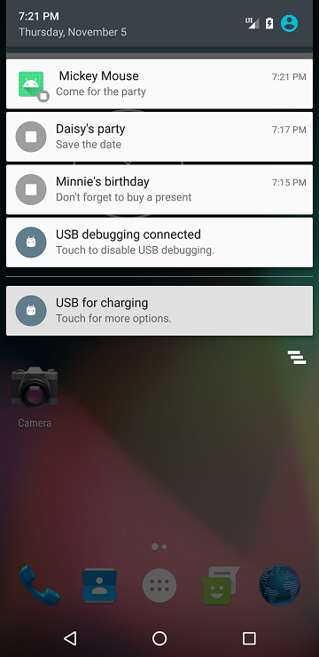

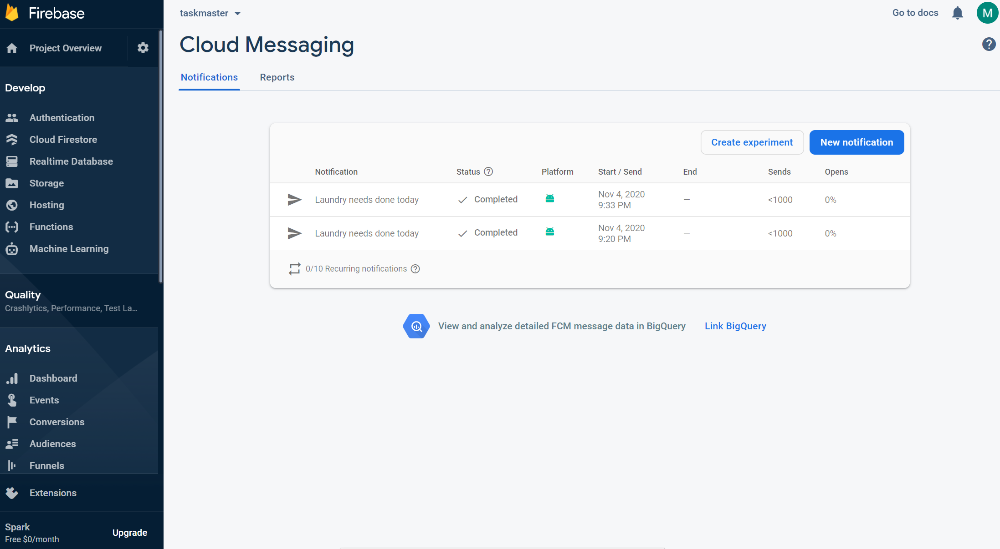

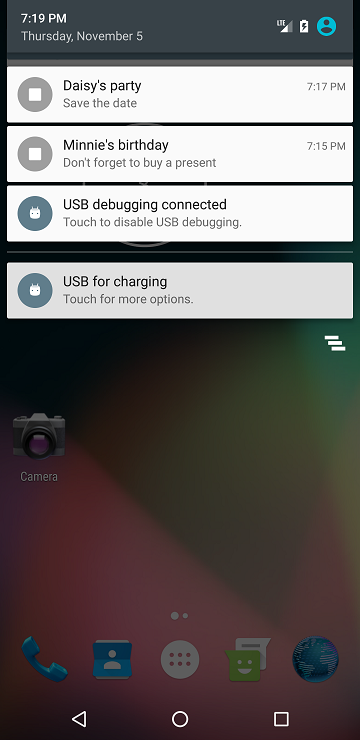

- Added notification service through AWS and Firebase

### Version 12.0

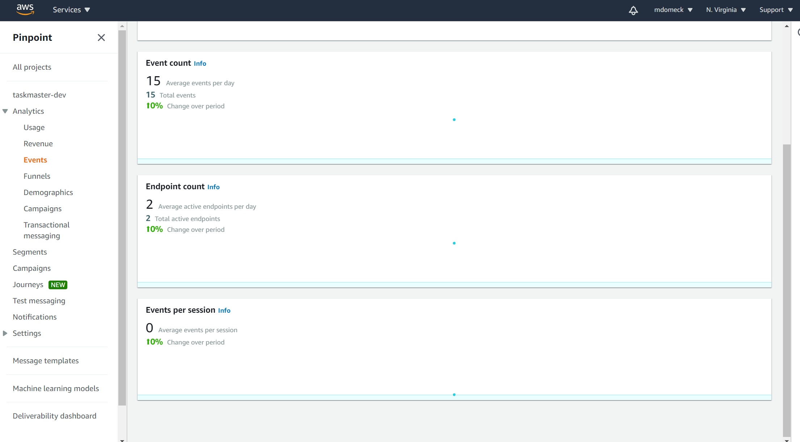

- Added Analytics when opening the app, adding a task on the add task page and picking a team on the setting page

### Version 13.0

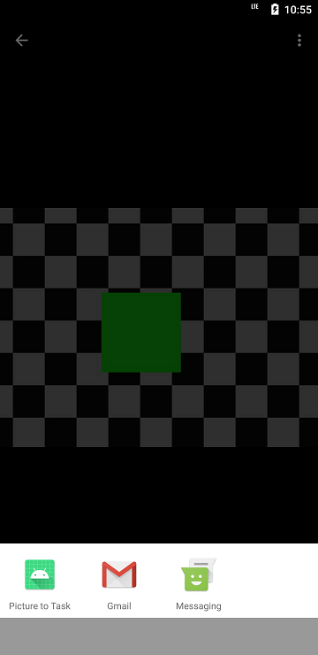
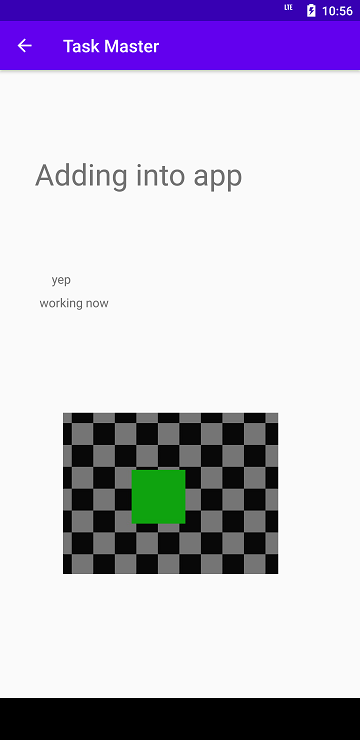

- Added an intent fileter to add an image from another application. Taken to the Add a task page. Able to save to task to a team.

