# Task Master

### Version 1.0
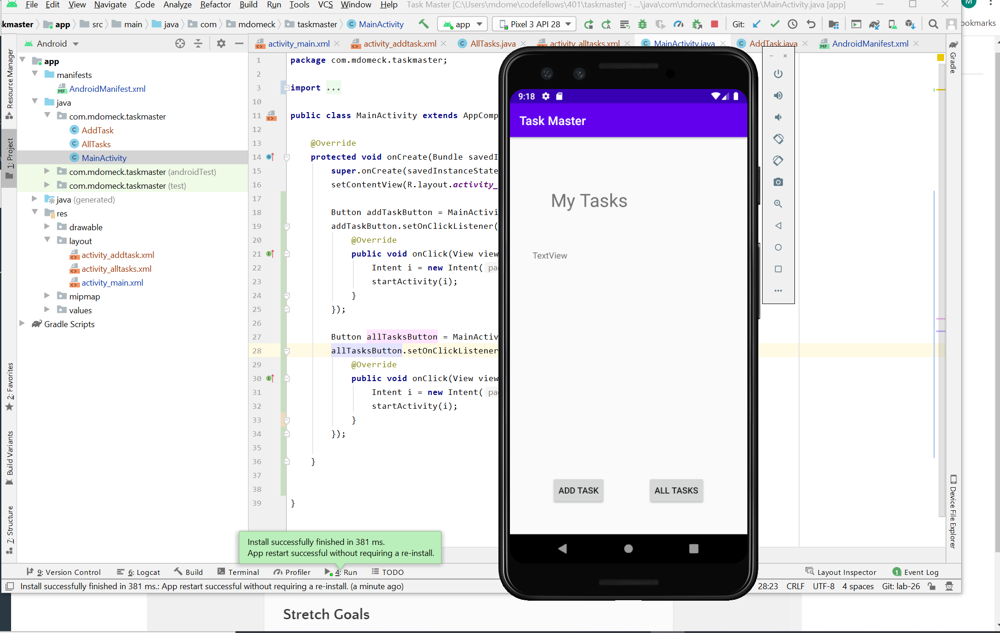

- Built home page
- Add Task button that links to Add Task page
- All Tasks button that links to All Tasks page

### Version 2.0
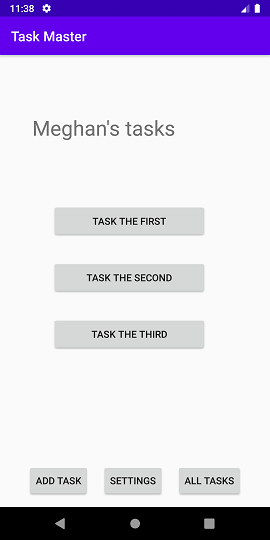
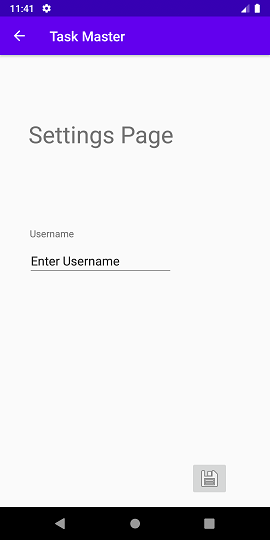
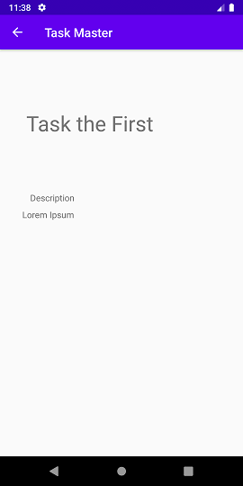
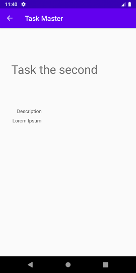

- Home page updated with Settings button and 3 taskLocal buttons
- Settings page added with username saved to the home screen
- Task buttons 1, 2, 3 that link and update title depending on what is selected.

### Version 3.0
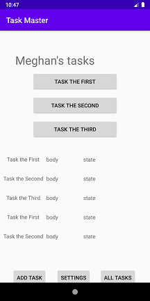

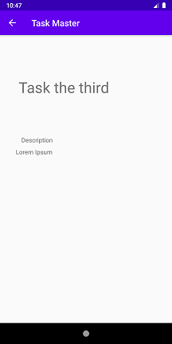

- Home page updated with RecyclerView that scrolls and you click on the title
- TaskAdapter class that displays data from a list of Tasks
- Task Model added. Task has title, body and a sta

### Version 4.0
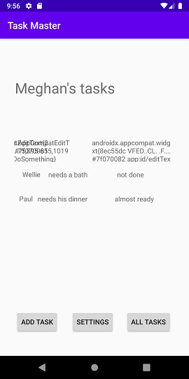

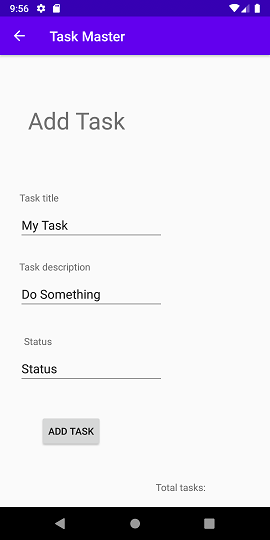

- Modify Add Task form to save the data entered in as a Task in your local database.
- Home page updated RecyclerView to display all Task entities in database
- Detail Page has description and status of a tapped taskLocal. Also displayed on the detail page in addition to the title.

### Version 5.0

- Added Expresso tests.
- verified all features are working
- no new features to take pictures of

### Version 6.0
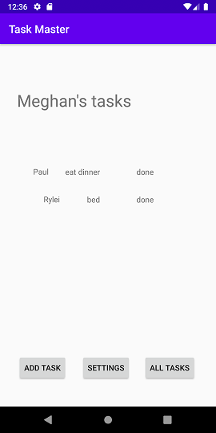

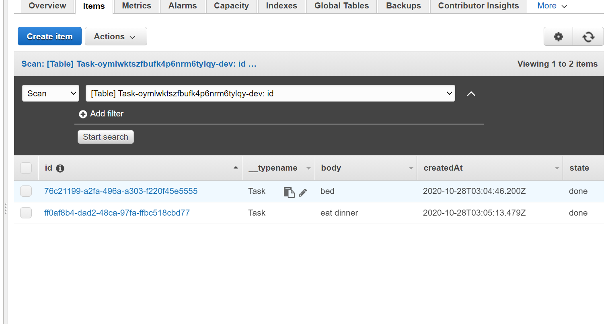

- Using `amplify add api` updated all Task data to instead use AWS Amplify
- Modify Add Task to save the data entered in as a task to DynamoDB
- Refactor homepage RecyclerView to display all Task entities in DynamoDB

### Version 7.0
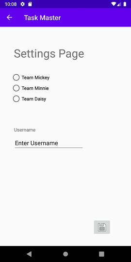

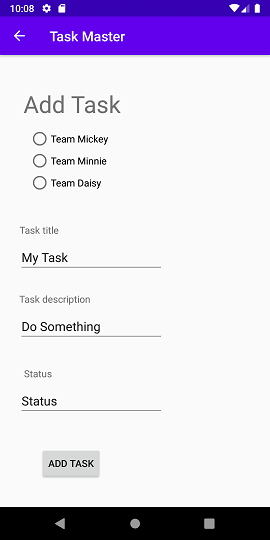

- create a second entity for a team 
- create 3 teams
- Modify Add Task to include radio buttons for which team that task belongs to
- Settings page updated to allow username and choosing their team.